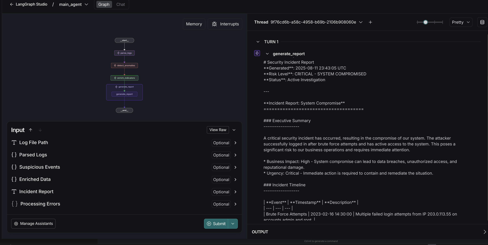
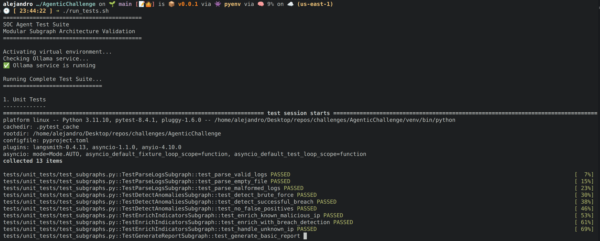
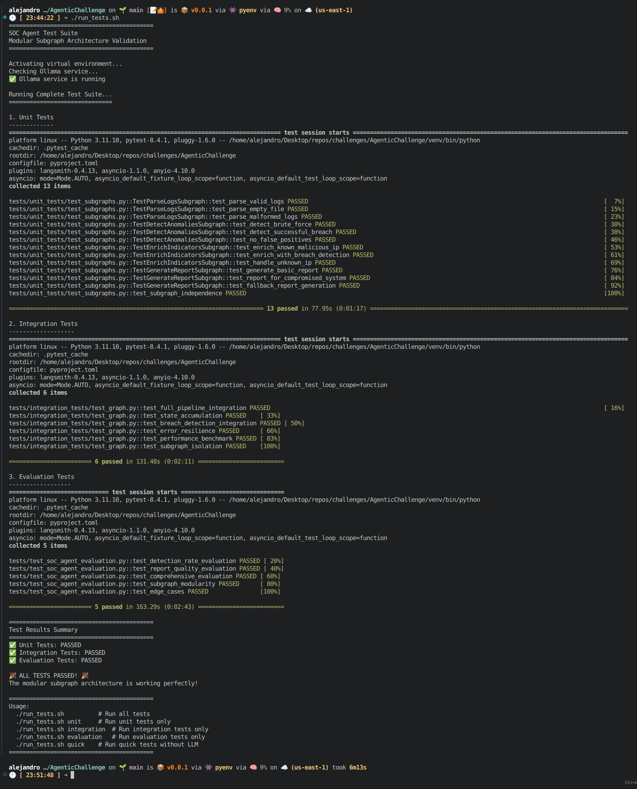

## AgenticChallenge


### Run LangGraph Studio
Start the local Studio for interactive development:
```bash
source venv/bin/activate && langgraph dev
```

In the Studio UI, click the "Submit" button to execute the graph.



### Run the Full Test Suite
Use the helper script to run unit and integration tests:
```bash
./run_tests.sh
```




### Completed Test Results
Summary of a successful full test suite run:




### Project Structure
```
AgenticChallenge/
  data/                      # Ground-truth and mock API responses
  images/                    # Screenshots used in this README
  src/agent/                 # Agent and subgraphs
  tests/                     # Unit, integration, and evaluation tests
  README.md                  # This file
  pyproject.toml             # Build and dependency config
```

### Notes
- The graphs live under `src/agent/` (e.g., `main_graph.py`, `subgraph_*`).
- See `tests/README.md` for testing details and `DESIGN_CHOICES.md` for design rationale.
